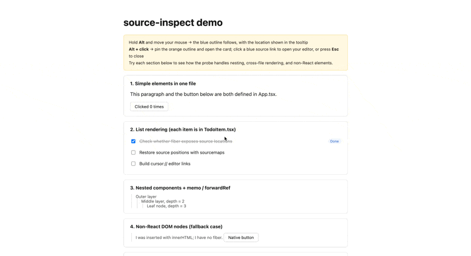

# Source Inspect

An experimental, zero-integration Chrome extension that maps an element in a React development page back to the JSX/TSX source that created it, then opens that location in VS Code or Cursor.



> **No project-code changes required.** Load the extension in Chrome; do not add a package, a Babel/Vite plugin, or application instrumentation. Source Inspect reads the React runtime and source maps already available in your development page.

> **Experimental.** Source Inspect relies on React development-only internals and accessible source maps. It is intended for local development, not production pages.

## Why

When inspecting a React UI, browser DevTools can show the DOM and styles but not always the source line that created an element. Source Inspect shortens that loop without modifying the project being inspected:

1. Hold `Alt` and point at an element.
2. See its source location and React component chain.
3. Pin the result with `Alt + click`.
4. Open the exact JSX/TSX location in your editor.

## Features

- Works as a browser extension only: no project packages, build-tool plugins, source transforms, or application-code changes.
- Maps React 18 source locations from `fiber._debugSource` when available.
- Maps React 19 JSX call sites from `fiber._debugStack`, then resolves generated locations through source maps.
- Displays the element, its parent source location, component chain, React version, and the resolution path.
- Opens locations in VS Code or Cursor through their native URL schemes.
- Falls back to the nearest React ancestor for DOM inserted outside React.
- Handles fullscreen masks and portals by inspecting `elementsFromPoint()` and capturing the Alt-click gesture before page handlers run.
- Infers absolute paths from Vite `/@fs/` URLs, compiler `fileName` literals, absolute source-map paths, `sourceRoot`, or a configured project root.

## Quick start

### 1. Load the extension

1. Open `chrome://extensions`.
2. Enable **Developer mode**.
3. Choose **Load unpacked** and select this repository directory.
4. Reload the extension and then reload the target page whenever extension code changes.

### 2. Run the included demo

```bash
pnpm --dir demo install
pnpm --dir demo dev
```

Open [http://localhost:5173](http://localhost:5173). The demo is only for verification; any supported local React development page works after loading the extension. The extension is injected only on `http://localhost/*` and `http://127.0.0.1/*`.

### 3. Configure the project root

For React 19, Source Inspect may need an absolute project root to turn a source-map path into a local file path. Click **Settings** in the result card, or open the extension options page, and map the page origin to the project directory:

```text
http://localhost:5173 -> /absolute/path/to/source-inspect/demo
```

The setting is stored locally in Chrome. If the isolated-world bridge is unavailable, the extension falls back to page `localStorage`.

## Usage

| Gesture | Result |
| --- | --- |
| Hold `Alt` and move the pointer | Shows a blue outline and a live source-location hint. |
| `Alt + click` an element | Pins an orange outline and opens a result card. |
| Click a blue location in the card | Opens the file, line, and column in the selected editor. |
| Press `Esc`, click `×`, or click outside the card | Closes the pinned result. |

The result card can show two different but useful concepts:

- **Source location**: the JSX expression that created the element.
- **Component chain**: the element's ownership in the Fiber tree.

They can differ when a parent creates an element and passes it to a child as `children` or another prop.

## Demo coverage

The demo exercises the cases that are easiest to get wrong:

1. Simple elements in one file.
2. List rendering across `TodoCard.tsx` and `TodoItem.tsx`.
3. Nested `memo` and `forwardRef` components.
4. DOM inserted with `innerHTML`, which has no Fiber and must fall back to a React ancestor.
5. An element passed through a prop, where source location and Fiber ownership differ.
6. A dropdown with a fullscreen mask that would otherwise steal `event.target`.

## Supported environments and limitations

| Area | Current behavior |
| --- | --- |
| Browser | Chrome 111+; the extension uses Manifest V3 `world: "MAIN"`. |
| Hosts | `http://localhost/*` and `http://127.0.0.1/*` only. HTTPS localhost, LAN IPs, and custom hosts are not injected. |
| React | React development builds only. React 18.3.1 and 19.2.8 were verified. |
| Production builds | Unsupported: React's debug source data is not available. |
| Source maps | Required for the React 19 path; the served module and its map must be fetchable from the page. |
| Editors | VS Code and Cursor. Other editors can be added to the `EDITORS` list in `content.js`. |
| Caching | Parsed source maps are cached in memory without a size cap. HMR query strings can create duplicate cache entries. |

## How it works

Source Inspect uses a small two-script architecture because React Fiber expandos are visible only from the page's main world, while `chrome.storage` is available only from the extension's isolated world.

| File | Context | Responsibility |
| --- | --- | --- |
| `content.js` | Main world | Reads React Fiber data, resolves source maps, renders the overlay/card, and opens editors. |
| `bridge.js` | Isolated world | Proxies configuration reads and writes through `chrome.storage.local`. |
| `options.html` / `options.js` | Extension page | Manages the editor choice and origin-to-project-root mappings. |

### React 18 and React 19

| React runtime | Signal | Resolution |
| --- | --- | --- |
| React 18 | `fiber._debugSource` | Already contains a source file, line, and column. |
| React 19 | `fiber._debugStack` | Provides a generated JSX call site; Source Inspect parses the source map to recover the original source location. |

For path inference, the extension prefers explicit paths over guesses: Vite `/@fs/` URLs, compiler-injected `fileName` values, absolute `sources`, `sourceRoot`, then a configured project root combined with the module URL or normalized `sources` path. If it cannot infer a safe absolute path, it reports the failure instead of opening a guessed file.

## Verification

Run the focused Node tests:

```bash
node test/path-infer.test.mjs
node test/placement.test.mjs
```

Build the React demo:

```bash
pnpm --dir demo build
```

To compare React runtime behavior without installing dependencies, start a local server from the repository root:

```bash
python3 -m http.server 5200
```

Then open [React 19](http://localhost:5200/test/probe.html?v=19) or [React 18](http://localhost:5200/test/probe.html?v=18).

## Roadmap

- Move large source-map parsing to a worker and add a bounded cache.
- Normalize HMR module URLs before caching.
- Validate more bundlers and framework-specific inspection paths.

## Contributing

This is an early-stage prototype. When reporting an issue, include the React version, bundler and dev-server version, module URL, source-map shape, and the expected versus actual source location. Run the verification commands above before submitting a change.

## License

No license has been selected yet. Do not redistribute or reuse the project beyond applicable law until a license is added.
